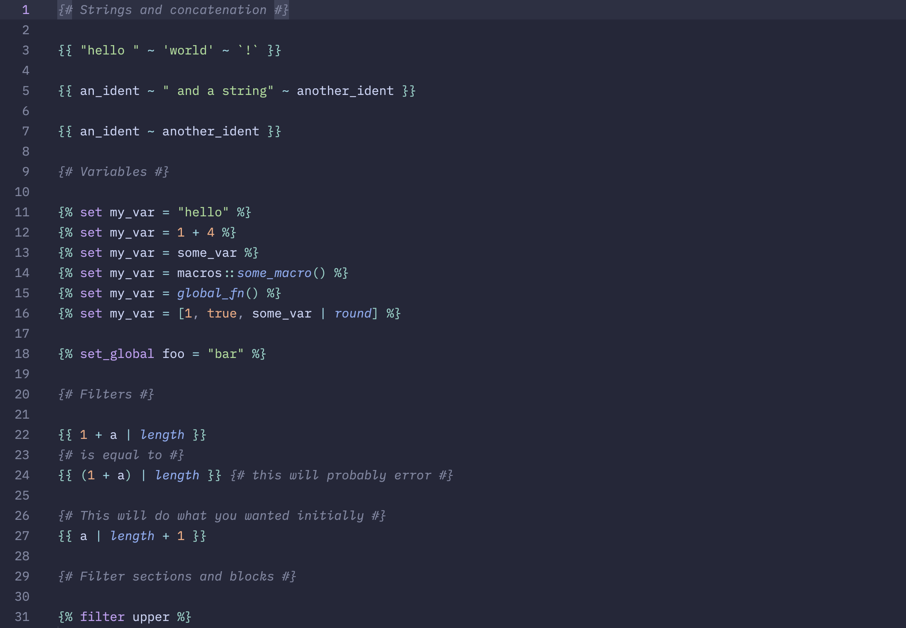

# zed-tera

_Zed with zed-tera. Screenshot taken with the [catppuccin/zed](https://github.com/catppuccin/zed) theme._

[Zed](https://github.com/zed-industries/zed) extension for the [Tera](https://keats.github.io/tera/) templating language.

## License

[MIT](LICENSE)
